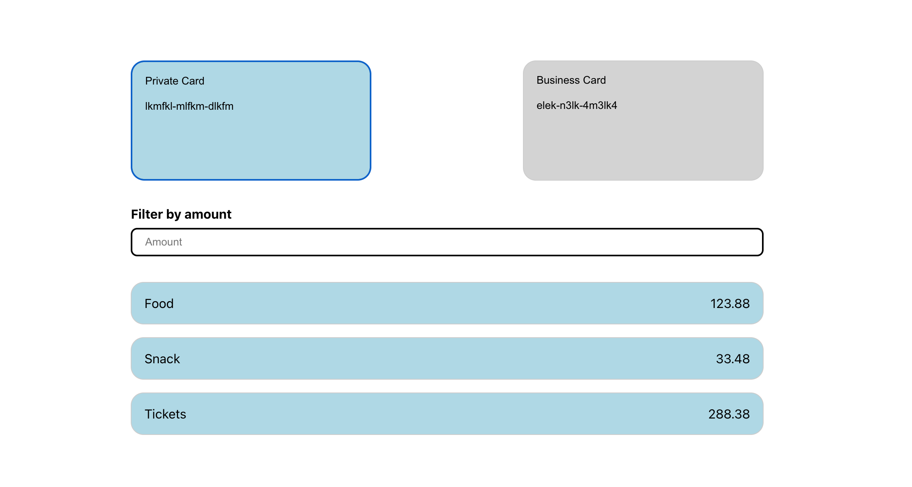

## How to Run the Project

**Install dependencies:**

```bash
yarn
# or
npm install
```

**Start the development server:**

```bash
yarn dev
# or
npm run dev
```

**Open the app in your browser:**

Once the development server is running, you can view the app at:

```bash
http://localhost:5174/
```

If the port is already in use, Vite may use a different one - check the terminal output to confirm.

**Run tests:**

```bash
yarn test
# or
npm test
```

**Run tests:**

```bash
yarn lint
# or
npm run lint
```

**Preview the production build:**

```bash
yarn preview
# or
npm run preview
```

## Implemented design



## Assumptions & Tradeoffs

- The app uses local JSON files as a mock data source, but the data-fetching logic is structured so it could easily be swapped for real API calls.
- I used React’s built-in state and hooks for state management, as the app is small and doesn’t require a global state library.
- Accessibility was a priority: interactive elements use semantic HTML (`<button>`, `<ul>`, `<li>`) and keyboard navigation is supported.
- I kept styling simple and focused on clarity and maintainability, using CSS files colocated with components where appropriate.
- I did not add routing or advanced state management, as the requirements did not call for it.

---

## What I Would Improve With More Time

- To enable code linting with npm run lint, I included ESLint in the project. While it is a third-party dependency, I chose to add it
  because it is an industry-standard tool for insuring code quality and consistency. I did spent too much time debugging issues though.
- Adjust the filter input to filter by words, since that is the main use for users. I would also introduce DOMPurify to sanitize HTML.
- Only show values that match the input exactly, as this would likely be more user-friendly.
- Add a reset option for the input.
- Add more comprehensive accessibility testing (e.g., using axe or jest-axe).
- Add additional styling for different breakpoints.
- Refine the UI/UX, possibly using a component library for more polished visuals and built-in accessibility.
- Add integration tests and more edge-case unit tests, especially if the app gets more complex.
- Add loading and error states for data fetching.

---

## Development Approach & Time Spent

- Planning & setup: ~1 hour (project structure, initial decisions)
- Component & hook implementation: ~1.5 hours
- Styling & accessibility: ~1 hour
- Testing & cleanup: ~1 hour
- Fixing Lint issue: ~1 hours
- **Total:** ~5.5 hours

I focused on separation of concerns, clean code, and accessibility throughout the implementation.

---

A video has also been added to the repository.
